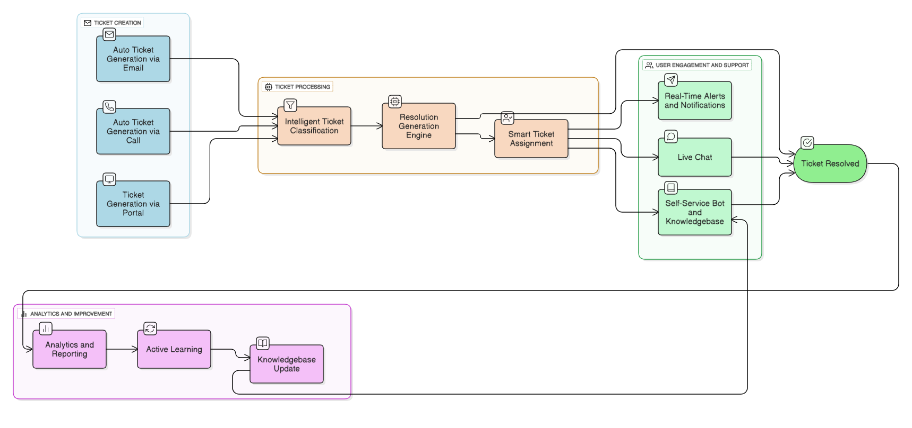

# Ticket Intake Classification System

An intelligent ticket classification system that uses LLM (GROQ) to extract metadata and classify IT support tickets automatically.

## Features

- **Ticket Creation API**: Create tickets with automatic metadata extraction and classification
- **Intake Classification Agent**: Uses LLM to extract metadata and classify tickets
- **Semantic Similarity Search**: Finds similar historical tickets using embeddings for better classification
- **PostgreSQL Integration**: Stores tickets in PostgreSQL database
- **FastAPI Backend**: Modern, fast, and automatically documented API
- **Database Exploration API**: Browse and explore database tables and data
- **Modular Architecture**: Clean, organized codebase with separation of concerns

## Workflow

workflow.png

## Prerequisites

- Python 3.8+
- PostgreSQL (running in Docker)
- GROQ API Key

## Setup

1. **Install Dependencies**:

```bash
pip install -r requirements.txt
```

2. **Set Environment Variables**:
   **IMPORTANT:** All credentials must be set in a `.env` file. No credentials are stored in code files.

   Create a `.env` file in the project root. You can copy from the example file:

   ```bash
   cp .env.example .env
   ```

   Then edit `.env` and set your actual values:

   ```bash
   GROQ_API_KEY=your_groq_api_key_here
   DB_HOST=localhost
   DB_PORT=5433
   DB_NAME=tickets_db
   DB_USER=USER
   DB_PASSWORD=PASSWORD
   ```

   **Security Notes:**

   - The `.env` file is required for the application to run
   - Never commit the `.env` file to version control (it's already in `.gitignore`)
   - All credentials are read from environment variables only - no hardcoded values in code
   - Replace `your_groq_api_key_here` with your actual GROQ API key
   - Replace `PASSWORD` with your desired database password
3. **Start PostgreSQL Database** (if not already running):

```bash
# Option 1: Use the helper script
./start_database.sh

# Option 2: Manual Docker command
# Make sure to set DB_PASSWORD in your .env file first, then:
source .env  # Load environment variables
docker run --name Autotask \
  -e POSTGRES_USER=USER \
  -e POSTGRES_PASSWORD="$DB_PASSWORD" \
  -e POSTGRES_DB=tickets_db \
  -p 5433:5432 \
  -v postgres-new-data:/var/lib/postgresql \
  -d postgres:18

**Note:** The `DB_PASSWORD` must be set in your `.env` file. The script will automatically load it.
```

4. **Initialize Database Tables**:

```bash
python scripts/init_database.py
```

5. **Import Historical Tickets** (optional):

```bash
python scripts/import_closed_tickets.py
```

6. **Run the Application**:

```bash
python main.py
```

Or using uvicorn directly:

```bash
uvicorn main:app --host 0.0.0.0 --port 5000 --reload
```

The API will be available at `http://localhost:5000`

- **API Documentation (Swagger UI)**: `http://localhost:5000/docs`
- **Alternative API Documentation (ReDoc)**: `http://localhost:5000/redoc`

## API Endpoints

### 1. Create Ticket

**POST** `/api/tickets/create`

Creates a new ticket and automatically processes it through the intake classification agent.

**Request Body**:

```json
{
    "title": "Email not working",
    "description": "I cannot send emails through Outlook. Getting error message 'Connection timeout'",
    "user_id": "user123",
    "due_date_time": "2024-12-10 10:00:00"
}
```

**Response**:

```json
{
    "success": true,
    "ticket_number": "T20241205.123456",
    "ticket_data": {
        "title": "Email not working",
        "description": "...",
        "user_id": "user123",
        "createdate": "2024-12-05T12:34:56",
        "duedatetime": "2024-12-10T10:00:00"
    },
    "extracted_metadata": {
        "main_issue": "...",
        "affected_system": "...",
        "urgency_level": "High",
        "error_messages": "...",
        "technical_keywords": [...],
        "user_actions": "...",
        "resolution_indicators": "...",
        "STATUS": "Open"
    },
    "classification": {
        "ISSUETYPE": {"Value": "1", "Label": "Incident"},
        "SUBISSUETYPE": {"Value": "5", "Label": "Email"},
        "TICKETCATEGORY": {"Value": "4", "Label": "Email/Communication"},
        "TICKETTYPE": {"Value": "2", "Label": "Incident"},
        "PRIORITY": {"Value": "2", "Label": "High"},
        "STATUS": {"Value": "5", "Label": "Open"}
    },
    "similar_tickets_found": 15
}
```

### 2. Get All Tickets

**GET** `/api/tickets`

Retrieves all tickets with pagination, filtering, and sorting.

**Query Parameters:**

- `limit` (int): Maximum number of tickets to return (1-1000, default: 50)
- `offset` (int): Number of tickets to skip for pagination (default: 0)
- `status` (str, optional): Filter by ticket status (e.g., 'Open', 'Closed', 'In Progress')
- `priority` (str, optional): Filter by priority level (e.g., 'High', 'Medium', 'Low')
- `issuetype` (str, optional): Filter by issue type
- `user_id` (str, optional): Filter by user ID
- `order_by` (str): Column to sort by (default: 'createdate')
- `order_direction` (str): Sort direction 'ASC' or 'DESC' (default: 'DESC')

**Response:**

```json
{
  "success": true,
  "tickets": [...],
  "total": 100,
  "limit": 50,
  "offset": 0,
  "has_more": true
}
```

**Example:**

```bash
# Get first 50 tickets
GET /api/tickets

# Get tickets with pagination
GET /api/tickets?limit=20&offset=40

# Filter by status
GET /api/tickets?status=Open

# Filter and sort
GET /api/tickets?status=Open&priority=High&order_by=createdate&order_direction=DESC
```

### 3. Get Ticket

**GET** `/api/tickets/{ticket_number}`

Retrieves ticket details by ticket number.

### 4. Health Check

**GET** `/api/health`

Checks the health status of the API and database connection.

### 5. Database Management

#### Start Database

**POST** `/api/database/start`

Starts the PostgreSQL Docker container and establishes connection.

#### Database Status

**GET** `/api/database/status`

Get current database connection status.

#### List Tables

**GET** `/api/database/tables`

Get list of all tables with row counts.

#### Table Information

**GET** `/api/database/tables/{table_name}`

Get detailed information about a specific table including columns and sample data.

**Query Parameters:**

- `include_sample` (bool): Include sample data (default: true)

#### Table Data

**GET** `/api/database/tables/{table_name}/data`

Get paginated data from a table.

**Query Parameters:**

- `limit` (int): Number of rows to return (1-1000, default: 50)
- `offset` (int): Number of rows to skip (default: 0)
- `order_by` (str): Column name to order by (optional)

## Project Structure

```
EasyMyTicket/
├── main.py                      # FastAPI application entry point
├── routes/                      # API route handlers
│   ├── ticket_routes.py        # Ticket creation and management routes
│   └── database_routes.py      # Database exploration routes
├── src/                         # Source code modules
│   ├── config.py               # Configuration management
│   ├── database/               # Database layer
│   │   ├── db_connection.py   # Database connection and operations
│   │   └── create_tables.sql  # Database schema
│   └── agents/                 # AI agents
│       └── intake_classification.py  # Ticket classification agent
├── scripts/                     # Utility scripts
│   ├── init_database.py        # Initialize database tables
│   ├── import_closed_tickets.py # Import historical tickets
│   └── README.md               # Scripts documentation
├── dataset/                     # Data files
│   └── ticket_data_updated.csv # Historical ticket data
├── start_database.sh           # Database startup script
├── workflow.png                # Workflow diagram
├── requirements.txt            # Python dependencies
└── README.md                   # This file
```

## Architecture

### Components

1. **Config** (`src/config.py`):

   - Centralized configuration management
   - Environment variable handling
   - Application settings
2. **DatabaseConnection** (`src/database/db_connection.py`):

   - Handles PostgreSQL connections
   - Provides GROQ LLM integration
   - Implements semantic similarity search using embeddings
3. **IntakeClassificationAgent** (`src/agents/intake_classification.py`):

   - Extracts metadata from tickets using LLM
   - Classifies tickets based on content and similar tickets
   - Provides fallback classification when LLM fails
4. **Ticket Routes** (`routes/ticket_routes.py`):

   - FastAPI REST API endpoints for ticket operations
   - Pydantic models for request/response validation
   - Orchestrates the intake classification workflow
5. **Database Routes** (`routes/database_routes.py`):

   - Database management endpoints
   - Table exploration and data browsing
   - Database status monitoring
6. **FastAPI Application** (`main.py`):

   - Main application setup with CORS middleware
   - Automatic API documentation generation
   - ASGI server (uvicorn) for high performance

## Workflow



1. **Ticket Creation**: User creates a ticket via API with title, description, user_id, and optional due_date_time
2. **Metadata Extraction**: Intake agent extracts structured metadata using LLM (`llama-3.1-8b-instant`)
3. **Similarity Search**: System finds similar historical tickets from `closed_tickets` table using semantic embeddings
4. **Classification**: Agent classifies ticket using LLM (`llama-3.3-70b-versatile`) based on metadata and similar tickets
5. **Database Storage**: Ticket is stored in `new_tickets` table with all classifications

## Models Used

- **Metadata Extraction**: `llama-3.1-8b-instant` (via GROQ)
- **Classification**: `llama-3.3-70b-versatile` (via GROQ)

## Database Schema

The system uses the following tables:

- `new_tickets`: Newly created tickets
- `resolved_tickets`: Historical resolved tickets
- `closed_tickets`: Historical closed tickets (used for similarity search)
- `technician_data`: Technician information
- `user_data`: User information

## Testing

Example curl command to create a ticket:

```bash
curl -X POST http://localhost:5000/api/tickets/create \
  -H "Content-Type: application/json" \
  -d '{
    "title": "Printer not working",
    "description": "The office printer is showing error code E-123 and cannot print documents",
    "user_id": "user456",
    "due_date_time": "2024-12-10 15:00:00"
  }'
```

## Notes

- The system automatically generates ticket numbers in format: `TYYYYMMDD.HHMMSS`
- Create datetime is automatically set to current timestamp
- Classification uses both LLM analysis and historical ticket patterns
- Fallback classification is available if LLM calls fail
